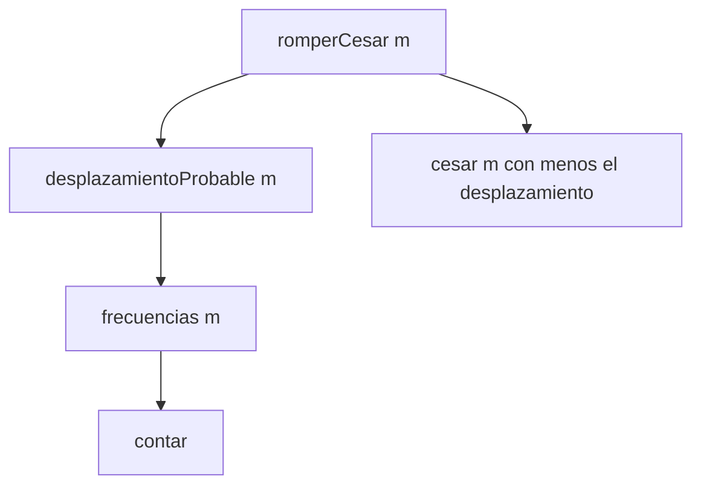

# Informe de corrección

## Notación

- $m$ es un mensaje. $\varepsilon$ es el mensaje vacío.
- $c \cdot t$ es un mensaje donde la primera letra es $c$ y el resto es $t$.
- $x \cdot y$ es pegar el texto $x$ delante del texto $y$.
- $p(c)$ es la posición que tiene $c$ (de 0 para `a` a 25 para `z`).
- Para una letra minúscula $c$ y un desplazamiento $k$:

$$d_k(c) = \text{letra en la posición } \big((p(c) + k) \bmod 26 + 26\big) \bmod 26$$

- Si $c$ no es una letra minúscula, $d_k(c) = c$.

El `+ 26` y el segundo `mod 26` sirven porque `-1 % 26` da $-1$.
Entonces el resultado siempre da entre 0 y 25.

**Propiedad que uso después:** Hacer descifrado.

$$d_{-k}\big(d_k(c)\big) = c$$

Porque $(p(c) + k - k) \bmod 26 = p(c)$.

## Punto 1: `cesar`

Definición de la función:

$$\text{cesar}(\varepsilon, k) = \varepsilon$$

$$\text{cesar}(c \cdot t, k) = d_k(c) \cdot \text{cesar}(t, k)$$

**Afirmación.** Todos los mensajes $m$ de $n$ letras, `cesar(m, k)` tiene
$n$ letras y la letra número $i$ del resultado es $d_k$ de la letra
número $i$ de $m$.

**Demostración de $n$.**

- *Caso base* ($n = 0$): $\text{cesar}(\varepsilon, k) = \varepsilon$, que no
  tiene letras se cumple.
- supongo que se cumple para mensajes de $n$ letras. Sea
  $m = c \cdot t$ con $t$ de $n$ letras. Por definición,
  $\text{cesar}(m, k) = d_k(c) \cdot \text{cesar}(t, k)$. El
  segundo pedazo tiene las letras de $t$ cifradas con $d_k$. La primera
  letra es $d_k(c)$. Entonces se cumple para $m$.

**Finalización:** en cada llamado el mensaje pierde una letra, entonces
siempre llega a $\varepsilon$.

**Cómo se encadenan los llamados** para `cesar("ab", 1)`:

$$\text{cesar}(\text{ab}, 1) = \text{b} \cdot \text{cesar}(\text{b}, 1) = \text{b} \cdot (\text{c} \cdot \text{cesar}(\varepsilon, 1)) = \text{b} \cdot \text{c} \cdot \varepsilon = \text{bc}$$

## Punto 2: `cesarCola`

Definición:

$$\text{cesarCola}(\varepsilon, k, acc) = acc$$

$$\text{cesarCola}(c \cdot t, k, acc) = \text{cesarCola}(t, k, acc \cdot d_k(c))$$

**Afirmación** Para todo $m$ y todo $acc$:

$$\text{cesarCola}(m, k, acc) = acc \cdot \text{cesar}(m, k)$$

**Demostración sobre la longitud de $m$.**

- *Caso base* ($m = \varepsilon$): $\text{cesarCola}(\varepsilon, k, acc) = acc = acc \cdot \varepsilon = acc \cdot \text{cesar}(\varepsilon, k)$.
- sea $m = c \cdot t$.

$$\text{cesarCola}(c \cdot t, k, acc) = \text{cesarCola}(t, k, acc \cdot d_k(c))$$

Por hipótesis de inducción (con $acc \cdot d_k(c)$ como acumulador):

$$= (acc \cdot d_k(c)) \cdot \text{cesar}(t, k) = acc \cdot \big(d_k(c) \cdot \text{cesar}(t, k)\big) = acc \cdot \text{cesar}(c \cdot t, k)$$

**Conclusión:** con $acc = \varepsilon$ se saca
$\text{cesarCola}(m, k, \varepsilon) = \text{cesar}(m, k)$. Las dos funciones dan
lo mismo en todas las entradas.

**Encadenamiento** para `cesarCola("ab", 1, "")`:

$$\text{cesarCola}(\text{ab}, 1, \varepsilon) = \text{cesarCola}(\text{b}, 1, \text{b}) = \text{cesarCola}(\varepsilon, 1, \text{bc}) = \text{bc}$$

## Punto 3: `frecuencias`

Sea $\text{cuenta}(x, m)$ el número de veces que la letra $x$ aparece en
$m$. Para la auxiliar `contar`:

$$\text{contar}(\varepsilon, acc) = acc$$

$$\text{contar}(c \cdot t, acc) = \begin{cases}
\text{contar}(t, acc \text{ con } c \text{ sumando 1}) & \text{si } c \text{ es minúscula} \\
\text{contar}(t, acc) & \text{si no}
\end{cases}$$

**Afirmación** Para cualquier letra minúscula $x$:

$$\text{contar}(m, acc)(x) = acc(x) + \text{cuenta}(x, m)$$

(donde $acc(x) = 0$ si $x$ no está en la tabla).

**Demostración sobre la longitud de $m$.**

- *Caso base:* $\text{contar}(\varepsilon, acc)(x) = acc(x) = acc(x) + 0$.
- sea $m = c \cdot t$. Si $c = x$, la nueva tabla tiene
  $acc(x) + 1$ y el resultado es
  $acc(x) + 1 + \text{cuenta}(x, t) = acc(x) + \text{cuenta}(x, m)$. Si
  $c \neq x$ o $c$ no es minúscula, la tabla no cambia para $x$ y también
  se cumple.

Con $acc$ vacía, $\text{contar}(m, \text{vacía})(x) = \text{cuenta}(x, m)$:
cada letra queda con su cantidad real. Las letras que no aparecen no
quedan en la tabla. Después se ordena la lista por de mayor a menor en cantidad
y por letra, que es lo que pide el enunciado.

**Encadenamiento** para `contar("aa", vacía)`:

$$\text{contar}(\text{aa}, \emptyset) = \text{contar}(\text{a}, \{a:1\}) = \text{contar}(\varepsilon, \{a:2\}) = \{a:2\}$$

## Punto 4: `desplazamientoProbable` y `romperCesar`

Sea $e$ la letra `e`, con $p(e) = 4$.

**Cuándo acierta.** Si el mensaje original tiene a la `e` como letra más
repetida y se cifró con $k$, en el cifrado la letra más repetida es
$d_k(e)$, con posición $(4 + k) \bmod 26$. La función calcula:

$$\big((4 + k) - 4\big) \bmod 26 = k \bmod 26$$

Entonces, recupera $k$. Después, `romperCesar` hace
$\text{cesar}(\text{cesar}(m, k), -k)$, y por la propiedad
$d_{-k}(d_k(c)) = c$ obtiene el mensaje original.

**Cuándo falla.** Esto falla si en el mensaje original la letra más
frecuente **no** es la `e`. También puede fallar cuando hay empate, porque
se elige la letra menor del texto *cifrado*, que puede no ser la que
la `e`.

**Ejemplo donde falla.** Sea el mensaje original `"casa"`,
cifrado con $k = 3$:

1. $\text{cesar}(\text{casa}, 3) = \text{fdvd}$.
2. En `"fdvd"` la letra más frecuente es `d` (se repite 2 veces).
3. El desplazamiento estimado es $p(d) - p(e) = 3 - 4 = -1$, que es $25$
   después de ajustarlo.
4. $\text{romperCesar}(\text{fdvd}) = \text{cesar}(\text{fdvd}, -25) = \text{gewe}$.

Como $\text{gewe} \neq \text{casa}$, el método está mal. Esto porque
en `"casa"` la letra más repetida es la `a`, no la `e`. Esto está
comprobado en `MisPruebasTest`.

**Encadenamiento de llamados:**

## Punto 5: `combinaciones`

Definición:

$$C(0, a) = 1 \qquad C(1, a) = a \qquad C(n, a) = (a - 1) \cdot C(n - 1, a) \text{ para } n > 1$$

**Afirmación.** Para $n \geq 1$:

$$C(n, a) = a \cdot (a - 1)^{n - 1}$$

**Demostración sobre $n$.**

- *Caso base* ($n = 1$): $C(1, a) = a = a \cdot (a-1)^0$.
- si $C(n, a) = a \cdot (a-1)^{n-1}$, entonces

$$C(n + 1, a) = (a - 1) \cdot C(n, a) = (a - 1) \cdot a \cdot (a - 1)^{n - 1} = a \cdot (a - 1)^{n}$$

Comprobación con el enunciado: $C(3, 26) = 26 \cdot 25^2 = 16250$.

**Finalización:** $n$ baja de 1 en 1 hasta llegar a 1 (se supone $n \geq 0$).

**Encadenamiento:**
$C(3, 26) = 25 \cdot C(2, 26) = 25 \cdot (25 \cdot C(1, 26)) = 25 \cdot 25 \cdot 26 = 16250$.

## Punto 5: `vigenere`

Sea $L$ la longitud de la clave (si $L = 0$, el mensaje se devuelve igual).
Sea $q(i)$ el desplazamiento de la letra de la clave en la posición
$i \bmod L$.

$$\text{aux}(\varepsilon, i) = \varepsilon$$

$$\text{aux}(c \cdot t, i) = \begin{cases}
d_{q(i)}(c) \cdot \text{aux}(t, i + 1) & \text{si } c \text{ es minúscula} \\
c \cdot \text{aux}(t, i) & \text{si no}
\end{cases}$$

**Afirmación.** Para todo $m$ y todo $i \geq 0$: la $j$-ésima letra
minúscula de $m$ (contando desde 0) queda cifrada con $d_{q(i + j)}$ y los
demás caracteres quedan igual.

**Demostración sobre la longitud de $m$.**

- *Caso base:* $\text{aux}(\varepsilon, i) = \varepsilon$, no hay nada que cifrar.
- *Paso inductivo:* sea $m = c \cdot t$.
  - Si $c$ es minúscula, es la letra número 0 y se cifra con $q(i)$. Las
    letras de $t$ pasan a ser la número $j - 1$ y se cifran con
    $q(i + 1 + (j - 1)) = q(i + j)$. Se cumple.
  - Si $c$ no es minúscula, se copia y $i$ no cambia. Las letras de $t$
    mantienen su número y su desplazamiento. Se cumple.

Esto es justo lo que pide el enunciado: los caracteres que no son letras no
consumen letra de la clave.

**Encadenamiento** para `vigenere("a b", "bc")`:

$$\text{aux}(\text{a b}, 0) = \text{b} \cdot \text{aux}(\text{ b}, 1) = \text{b} \cdot \text{ } \cdot \text{aux}(\text{b}, 1) = \text{b} \cdot \text{ } \cdot \text{d} \cdot \text{aux}(\varepsilon, 2) = \text{b d}$$