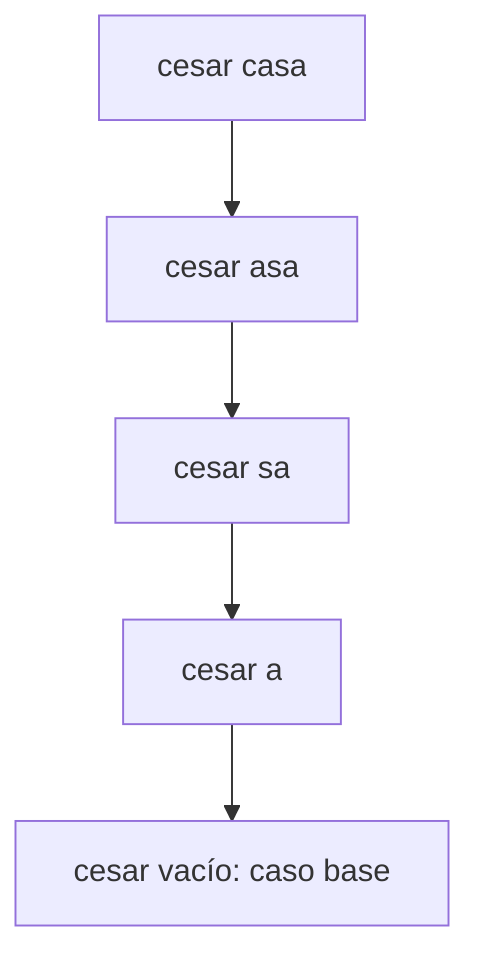
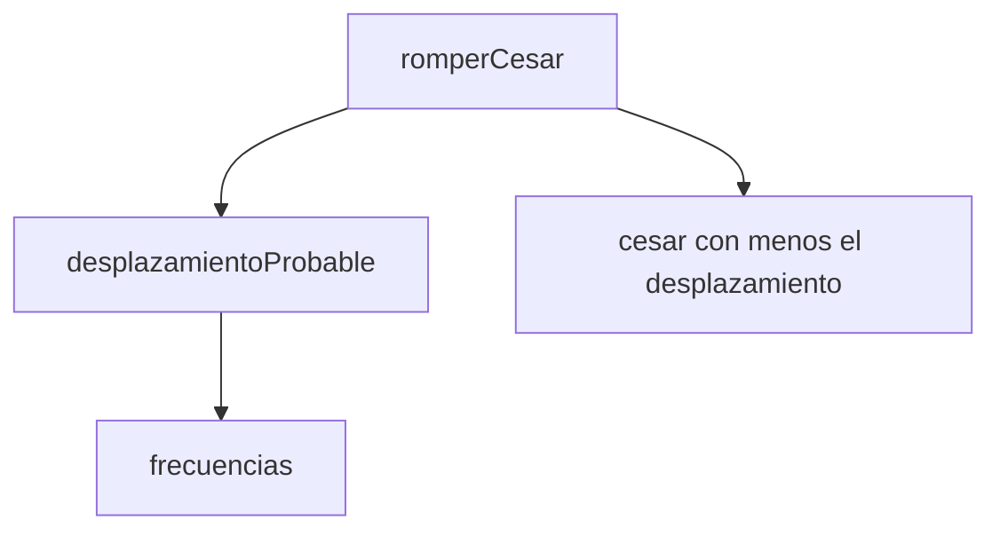

# Informe de proceso

## Punto 1: `cesar` (recursión lineal)

**Idea:** se cifra la primera letra y le pego adelante el resultado de cifrar
el resto del mensaje. Si el mensaje está vacío, devuelvo vacío.

Ejemplo: `cesar("casa", 3)`.

| Paso | Pila de llamados |
|---|---|
| 1 | `cesar("casa")` |
| 2 | `cesar("casa")`, `cesar("asa")` |
| 3 | `cesar("casa")`, `cesar("asa")`, `cesar("sa")` |
| 4 | `cesar("casa")`, `cesar("asa")`, `cesar("sa")`, `cesar("a")` |
| 5 | `cesar("casa")`, `cesar("asa")`, `cesar("sa")`, `cesar("a")`, `cesar("")` |

En el paso 5 `cesar("")` devuelve `""`. Ahora la
pila se vacía, y cada llamado pega su letra:

| Paso | Devuelve | Resultado |
|---|---|---|
| 6 | `cesar("a")` devuelve `"d" + ""` | `"d"` |
| 7 | `cesar("sa")` devuelve `"v" + "d"` | `"vd"` |
| 8 | `cesar("asa")` devuelve `"d" + "vd"` | `"dvd"` |
| 9 | `cesar("casa")` devuelve `"f" + "dvd"` | `"fdvd"` |

**Por qué la pila crece:** después de cada llamado todavía hay una
operación pendiente que es pegar la letra con `+`. Por eso cada llamado debe
esperar al siguiente y con un mensaje de $n$ letras llegan a quedar $n+1$
llamados.

## Punto 2: `cesarCola`

**Idea:** voy guardando lo que ya se cifró en un acumulador `acc`. Cada
llamado cifra una letra, la agrega a `acc` y se llama con los otros. Cuando
el mensaje se acaba, devuelvo `acc`.

Ejemplo: `cesarCola("casa", 3)`.

| Paso | Llamado | `m` | `acc` |
|---|---|---|---|
| 1 | `cesarCola("casa", 3, "")` | `"casa"` | `""` |
| 2 | `cesarCola("asa", 3, "f")` | `"asa"` | `"f"` |
| 3 | `cesarCola("sa", 3, "fd")` | `"sa"` | `"fd"` |
| 4 | `cesarCola("a", 3, "fdv")` | `"a"` | `"fdv"` |
| 5 | `cesarCola("", 3, "fdvd")` | `""` | `"fdvd"` |

En el paso 5 el mensaje está vacío y se devuelve `acc`, o sea `"fdvd"`.

**Estado de la pila:** en cada paso la pila tiene solo 1 llamado. Cuando
se hace el siguiente, el anterior ya no necesita esperar porque la
llamada recursiva es lo último. Por eso se reutiliza el mismo
espacio (la anotación `@tailrec` lo comprueba).

| Paso | Pila |
|---|---|
| 1 | `cesarCola("casa", "")` |
| 2 | `cesarCola("asa", "f")` |
| 3 | `cesarCola("sa", "fd")` |
| 4 | `cesarCola("a", "fdv")` |
| 5 | `cesarCola("", "fdvd")` |

**Diferencia con `cesar`:** `cesar` crece una posición por letra y
`cesarCola` siempre usa somente 1 espacio. Por eso `cesarCola` aguanta un
mensaje muy largo sin sobrecargar la pila.

## Punto 3: `frecuencias`

**Idea:** uso una función auxiliar llamada `contar` que recorre el mensaje con un
acumulador que es una tabla (`Map`) de letra y cantidad. Si la letra es
minúscula, le sumo 1 en la tabla. Si no, la ignoro. Al final paso la tabla
a lista y la ordeno, primero la de más repeticiones y si empatan, la
letra menor.

Ejemplo: `frecuencias("casa")`.

| Paso | `resto` | Tabla `acc` |
|---|---|---|
| 1 | `"casa"` | vacía |
| 2 | `"asa"` | c: 1 |
| 3 | `"sa"` | c: 1, a: 1 |
| 4 | `"a"` | c: 1, a: 1, s: 1 |
| 5 | `""` | c: 1, a: 2, s: 1 |

En el paso 5 se devuelve la tabla. Luego se convierte en lista y se ordena:
`List(('a',2), ('c',1), ('s',1))`.

**Pila:** `contar` es cola, entonces en cada paso hay un solo llamado
(`contar("casa")`, luego `contar("asa")` y así sucesivamente hasta `contar("")`).

## Punto 4: `desplazamientoProbable` y `romperCesar`

Estas dos no son recursivas porque usan funciones de los puntos
anteriores.

**`desplazamientoProbable("hhhaa")`:**

1. Llama a `frecuencias("hhhaa")` y obtiene `List(('h',3), ('a',2))`.
2. La lista no está vacía, entonces toma la letra de la primera pareja: `'h'`.
3. Calcula la distancia a la `e`: $7 - 4 = 3$.
4. Devuelve `3`.

Si el mensaje no tiene letras `frecuencias` da una lista vacía y devuelve `0`.

**`romperCesar("fdvd")`:**

1. Llama a `desplazamientoProbable("fdvd")`. La letra mas repetida es `d`,
   y $3 - 4 = -1$, que se vuelve $25$ al sumarle 26 y sacar el residuo.
2. Llama a `cesar("fdvd", -25)`, que corre cada letra 1 posición hacia
   adelante.
3. Devuelve `"gewe"`.

Pila de llamados:

| Paso | Pila |
|---|---|
| 1 | `romperCesar("fdvd")` |
| 2 | `romperCesar`, `desplazamientoProbable("fdvd")` |
| 3 | `romperCesar`, `desplazamientoProbable`, `frecuencias("fdvd")` |
| 4 | `romperCesar`, `desplazamientoProbable` (ya tiene la lista) |
| 5 | `romperCesar` (ya tiene el número 25) |
| 6 | `romperCesar`, `cesar("fdvd", -25)` sus llamados recursivos |

## Punto 5: `combinaciones`

**Idea:** Se sigue la fórmula del enunciado. Si $n = 0$ devuelvo 1. Si
$n = 1$ devuelvo $a$. Si no, multiplico $(a-1)$ por el resultado con
$n - 1$.

Ejemplo: `combinaciones(3, 26)`.

| Paso | Pila |
|---|---|
| 1 | `combinaciones(3, 26)` |
| 2 | `combinaciones(3, 26)`, `combinaciones(2, 26)` |
| 3 | `combinaciones(3, 26)`, `combinaciones(2, 26)`, `combinaciones(1, 26)` |

`combinaciones(1, 26)` es caso base y devuelve $26$. La pila se vacía:

| Paso | Combinación | Resultado |
|---|---|---|
| 4 | `combinaciones(2, 26)` devuelve $25 \cdot 26$ | $650$ |
| 5 | `combinaciones(3, 26)` devuelve $25 \cdot 650$ | $16250$ |

Uso `BigInt` porque los números crecen rápido y no caben en un `Int`.

## Punto 5: `vigenere`

**Idea:** igual que `cesar`, pero el desplazamiento de cada letra sale de
la clave. La auxiliar `aux(resto, i)` lleva el número `i` de la letra de la
clave que toca usar. Uso `i % clave.length` para que la clave se repita.
Si el carácter no es letra minúscula, lo copio y **no** aumento `i`.

Ejemplo: `vigenere("ataque", "sol")`.

| Paso | Llamado | Letra | Letra de la clave | Resultado de la letra |
|---|---|---|---|---|
| 1 | `aux("ataque", 0)` | a | s | s |
| 2 | `aux("taque", 1)` | t | o | h |
| 3 | `aux("aque", 2)` | a | l | l |
| 4 | `aux("que", 3)` | q | s (porque 3 % 3 = 0) | i |
| 5 | `aux("ue", 4)` | u | o | i |
| 6 | `aux("e", 5)` | e | l | p |
| 7 | `aux("", 6)` | | | caso base: `""` |

La pila crece hasta el paso 7 (como en `cesar`) y luego se vacía pegando
las letras de atrás hacia adelante: `"p"`, `"ip"`, `"iip"`, `"liip"`,
`"hliip"`, `"shliip"`.

Ejemplo con espacio: `vigenere("a b", "bc")`.

| Paso | Llamado | Qué pasa |
|---|---|---|
| 1 | `aux("a b", 0)` | `a` con clave `b` da `b`, y sigue con `i = 1` |
| 2 | `aux(" b", 1)` | el espacio se copia y `i` **se queda en 1** |
| 3 | `aux("b", 1)` | `b` con clave `c` da `d`, y sigue con `i = 2` |
| 4 | `aux("", 2)` | caso base: `""` |

Resultado: `"b d"`.